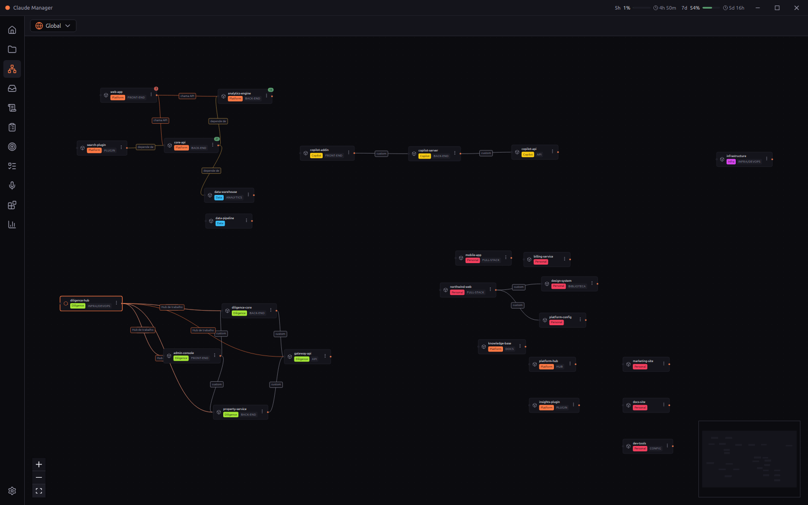
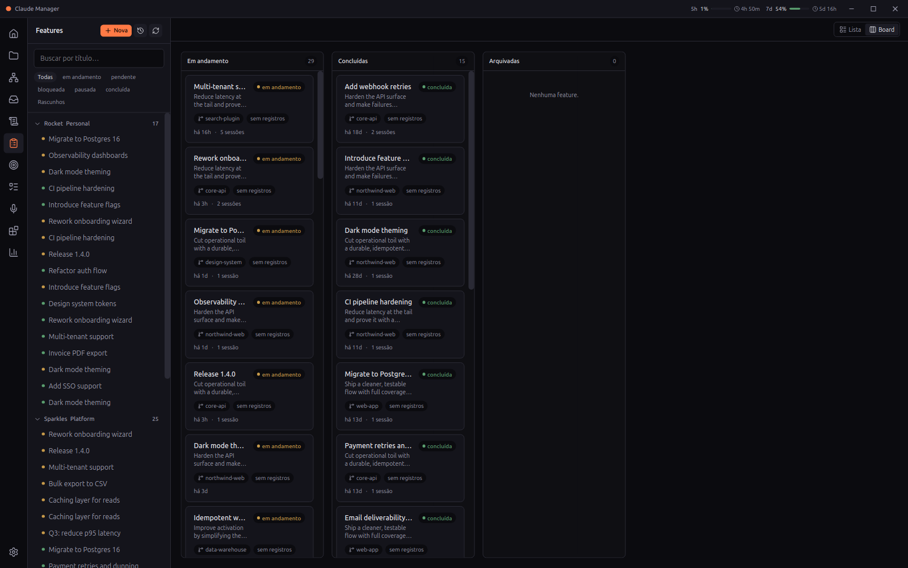

<div align="center">

# Claude Manager

**A desktop cockpit for running and managing many [Claude Code](https://claude.com/claude-code) sessions across your projects and repositories.**

Chat *and* terminal views per session · multi-repo orchestration with cross-session handoffs · cross-machine sync · planning boards exposed over MCP · meeting transcription · usage metrics.

[](https://github.com/ThiagoEMatumoto/claude-manager/releases/latest)
[](https://github.com/ThiagoEMatumoto/claude-manager/releases/latest)
[](./LICENSE)
[](https://www.electronjs.org/)

<br/>


<sub>A quick tour: repository dependency graphs, multi-repo orchestration, and planning boards. <em>(Screens use a fictional dataset · <a href="docs/assets/demo.mp4">watch the MP4</a>)</em></sub>

</div>

---

Claude Code is a terminal-first agent. **Claude Manager** wraps it in a desktop app so you can drive several agents at once — each in its own project and repo — without juggling terminal tabs. It keeps a local database of your projects, sessions, plans and repositories, renders each session as either a live terminal or a structured chat, and connects related repositories so a session in one repo can hand work off to a session in another.

> **Status:** actively developed, versioned releases for macOS, Windows and Linux. Some intelligence features are marked _experimental_ below.

## Features

### 🖥️ Session management
- Launch and manage **multiple concurrent Claude Code sessions**, each bound to a project/repo, over a real PTY (`node-pty`).
- **Two views per session, toggleable:** a full terminal (xterm.js with fit/search/web-links/clipboard) or a **native chat view** that renders the session transcript as message bubbles, plan cards, tool calls, thinking blocks, sub-agent cards and interactive question cards.
- **Composer controls** without typing slash commands: pick the **model**, **reasoning effort** (up to `xhigh`), and **permission mode** (`default`, `acceptEdits`, `plan`, `auto`, `bypassPermissions`, `dontAsk`); paste images; watch a live context indicator.
- Multi-session switcher, command palette, and per-repo session routing.

### 📁 Projects, repos & cross-machine sync
- Organize repositories into **projects** under a "vault" root; auto-detects untracked folders you haven't registered yet.
- **Sync your workspace across machines**: app state (projects, repos, plans, tasks) is serialized to a Git bundle and pushed/pulled automatically (debounced, on-idle). Git auth reuses your `gh` credential helper — no tokens on disk.
- **Auto-clone missing repos**: a repo registered on one machine is cloned automatically on the others.
- **Pull-all**: update every local repo with one click (`git pull --ff-only`, skipping dirty/diverged repos), plus an opt-in periodic auto-pull.

### 🕸️ Multi-repo orchestration & handoffs
- Model **dependencies between repositories** as an interactive architecture graph (`@xyflow/react`); the architecture context is injected into each session's system prompt.
- **Cross-repo handoffs**: a "mother" session can delegate a scoped task to a "child" session in another repo, with a human approval step and progress/result streaming back.



### 🎯 Planning: objectives, key results, tasks & features
- Track **objectives → key results**, **tasks**, and **features** in dedicated boards backed by local SQLite.
- Everything is exposed through a built-in **Model Context Protocol (MCP) server**, so Claude Code sessions can read and update your objectives, tasks, features and handoffs directly as tools.



### 🎙️ Meeting Intelligence
- Record and **transcribe meetings locally** via a Python sidecar (`faster-whisper` large-v3 + speaker diarization with `sherpa-onnx`), with a live transcript view and a guided installer.
- Structured extraction (action items, etc.) via a local **Ollama** model, plus an ICS **calendar watcher**.

### 🔬 Deep Research Dossiers _(experimental)_
- A staged research pipeline with human approval gates and checkpoints. The orchestration and review flow are real; web ingestion (Tavily) and final synthesis are still being built out.

### 📊 Usage metrics
- A local metrics dashboard (built from your Claude Code JSONL transcripts) showing token usage and cost, top tools, and an agent-orchestration KPI, rendered with Recharts.

## Install

**Download a prebuilt app** from the [latest release](https://github.com/ThiagoEMatumoto/claude-manager/releases/latest):

| Platform | Artifact |
|----------|----------|
| macOS    | `.dmg` (Apple Silicon) or `.zip` |
| Windows  | `Claude-Manager-Setup-*.exe` |
| Linux    | `.AppImage` or `.deb` |

The app auto-updates via `electron-updater`.

> Claude Manager drives the Claude Code CLI, so you'll want [Claude Code](https://claude.com/claude-code) installed and authenticated on the machine.

## Development

Requirements: **Node 20+**.

```bash
npm install
npm run dev      # electron-vite dev with HMR
```

`npm run dev` is the only command needed to iterate. React (renderer) changes hot-reload in seconds. Changes to the main process (`electron/main/**`) or preload (`electron/preload/**`) require restarting `npm run dev`.

Other scripts:

```bash
npm run typecheck     # tsc across node, web and test projects
npm run test:unit     # vitest
npm run e2e           # Playwright end-to-end
npm run build         # electron-vite production build
npm run dist:linux    # package installers (also :mac / :win)
```

## Architecture

```
electron/
  main/
    ipc/          # IPC handlers (projects, git, sync, sessions, mcp, …)
    services/     # pty-manager, sync (git bundle), handoff, meeting,
                  # dossier, metrics, migrations, MCP server, git-auth
  preload/        # contextIsolation bridge (window.api.*)
shared/
  types/          # types shared across main ↔ renderer
src/
  app/            # App root, IconRail navigation, stores (Zustand)
  features/       # projects, sessions, chat, handoffs, meetings,
                  # dossiers, objectives, tasks, features, metrics, settings
  lib/            # renderer-side IPC helpers
sidecar/          # Python meeting-transcription sidecar
```

**Stack:** Electron 32 · React 18 · TypeScript · electron-vite · Tailwind CSS 4 · Zustand · SQLite (`better-sqlite3`) · `node-pty` · xterm.js · `simple-git` · `@xyflow/react` · Recharts · `@modelcontextprotocol` SDK. Tested with Vitest and Playwright.

## MCP server

Claude Manager ships an MCP server (stdio) that exposes your planning data and orchestration primitives as tools — `objective_*`, `key_result_*`, `task_*`, `feature_*`, `overview_get`, `repo_connections_get`, `session_handoff`, and the `handoff_*` family. Point a Claude Code session at it to let the agent keep your objectives, tasks and features up to date while it works.

## Contributing

Issues and pull requests are welcome. For substantial changes, open an issue first to discuss the direction.

## License

[MIT](./LICENSE) © Thiago Matumoto
